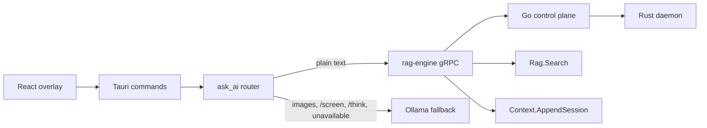

# rag-engine Integration

Thuki uses `KB-Helios/rag-engine` as a Git submodule at `external/rag-engine`.
The submodule is pinned by `.gitmodules` plus the gitlink; its source is not
vendored into this repository.

```bash
git submodule update --init --recursive
bun run engine:build
```



## Runtime Path

For normal text chat, `ask_ai` checks rag-engine readiness, runs `Rag.Search`
with `[engine].context_top_k`, emits `ContextSources` to the frontend, prepends
a bounded local-context block, and streams the answer through
`Runtime.StreamInference`.

After a completed response, Thuki keeps SQLite conversation history as the UI
source of truth and best-effort appends user and assistant turns to
`Context.AppendSession`.

## Fallbacks

Ollama remains active for v1 paths rag-engine does not yet support in Thuki:
image input, `/screen`, `/think`, engine startup failure, and any explicit
configuration where `[engine].enabled = false`.

`/search` stays live web search. Its retrieval semantics are unchanged; local
RAG context is separate and applies to normal chat turns.

## Managed Data

Managed engine config is generated under Thuki app data:

- `rag-engine/models`
- `rag-engine/rag`
- `rag-engine/context`
- `rag-engine/embedding-cache`

The bundled sidecar is configured through Tauri `externalBin` as
`binaries/ai-engine-server`. The build script writes the target-triple suffixed
binary into `src-tauri/binaries/`, matching Tauri v2 sidecar packaging rules.
